# Computers, Programming & Stuff

## Git

### rename branch: 
````
git branch -m <old> <new>
````
### GPG signed commits
> Create verified commits<br>
> #gpg #git #hithub

1. Install GPG Suite from https://gpgtools.org
2. Generate a new gpg key with GPG Keychain
3. Save the public key somewhere you will find it!
4. Add the public key to gitHub:
   1. navigate to https://github.com/settings/keys
   2. select [New GPG Key](https://github.com/settings/gpg/new)
   3. Copy and paste the public key block; -> begins with:
    ````
    -----BEGIN PGP PUBLIC KEY BLOCK-----
    ````
5. Tell git to sign commits
   1. Fire up a local terminal
   2. find the key ID of the previously generated Key
    ````
    % gpg --list-secret-keys --keyid-format=long
    `````
   3. From the list of GPG keys, copy the long form of the GPG key ID for the pubkic key you've added to gitHub. The GPG key ID looks something like `3CC7D39017658BD1` -> see this example:
   ````
    % gpg --list-secret-keys --keyid-format=long 
    /Users/exampleuser/.gnupg/pubring.kbx
    ------------------------------------
    sec   rsa4096/3CC7D39017658BD1 2023-06-25 [SC]
          BD2D9C59394D7F4F8680DEB80FA94B9E0B5C93C0
    uid                 [ultimate] github <example@email.com>
    ssb   rsa4096/CC50DC7499FF0A21 2023-06-25 [E]
    ````
    4. Set the GPG signing key ID in Git; In this example, the GPG key ID is `3CC7D39017658BD1`:
    ```
    % git config --global user.signingkey 3CC7D39017658BD1
    ``` 
    5. [optional] Configure Git to sign all commits by default:
    ````
    % git config --global commit.gpgsign true
    ````

### fetch remote branch other than master/main:

    git fetch origin

> fetches all remote branches available 
  
    % git branch -v -a

> shows all branches ready to checkout<br>
> &rarr; checkout remote branch like:

    % git checkout -b <branchname> origin/<branchname>

### Remote Repositories

* Add remote repo:

        % git remote add <repo name (best practise: origin)> <remote repository url>


* get remote repository origin url:

        % git remote get-url origin

* change remote repository:

        % git remote set-url origin <remote repository url>

* update forked repository: (the circuitous way)
	```
    git remote add upstream <REPO-URL>
    git fetch upstream
    git checkout <BRANCH>
    git reset --hard upstream/<BRANCH>
    git push origin <BRANCH> --force
    ```

### fix: unable to create file \<filename\>: Filename too long
* **Alt1**: 
  ```
  git config --system core.longpaths true`
  ```
    * Admin rights may be required
* **Alt2**: open C:\Program Files\Git\etc\gitconfig -> under `[core]` add `longpaths = true`
    * Admin rights may be required.

### Checkout specific commit
    % git log --oneline
> find commit hash to check out

    % git checkout <commit-hash>

## GitHub
### Code/PR Review
* Collapse all files:<br>
`ALT + Click` on any caret on the left of a file name
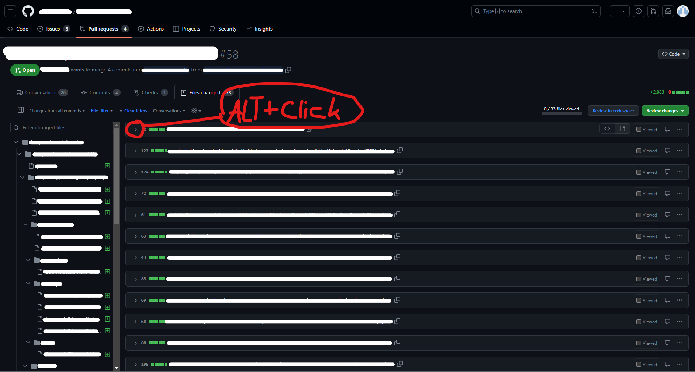

## PostgreSQL

* start db server:
    * Environment Variable PGDATA festlegen (default [WINDOWS]: C:\Program Files\PostgreSQL\14\data)
    ```
    pg_ctl start -l logfile (startet db server im Hintergrung und schreibt loggs in "logfile")
    ```

* stop db server:
    ```
    pg_ctl stop
    ```

* check if running [WINDOWS]: 

    * Alt1:
        * WIN+R
        * `services.msc`
        * look for postgresql-[version]
    * Alt2:
        * fire up a terminal
        * `pg_ctl status`

* change pw:
    ````
    psql -U <username>
    postgres=# \password <username>
    Enter new password: <new-password>
    postgres=# \q
    ````

## key pairs with `openssl` [POSIX]

### generate rsa key pair

> #openssl #rsa #ed25519 #ssl
1. generate private rsa key [stores the private key in the current directory]
    ````
    % openssl genrsa -out <private key name> <size in bytes>
    ````
2. generate public key
    ````
    % openssl rsa -in <private key name> -pubout -outform <output format (e.g. PEM)> -out <private key name>
    ````
> **Notes**
> * documentation (POSIX)
>     ````
>     % man openssl
>     ````

### generate ed25519 key pair
> #binance test net
1. generate private ed25519 key [stores the private key in the current directory]
    ````
    % openssl genpkey -algorithm ed25519 -out <private key name>
    ````
2. generate public key
    ````
    % openssl pkey -pubout -in <private key name> -out <public key name>
    ````
> **Notes**
> * Useful Links:
>   * https://testnet.binance.vision

## ssh

### generate ssh key pair [POSIX]

> #ssh #encryption #encoding #POSIX #github
1. generate ssh key pair (example)
    ````
    % ssh-keygen -t rsa -b 4096 -f <keyname>
    ````
2. [optional] convert key format (example) -> e.g., to use rsa public key with PKCS8 format
    ```
    % ssh-keygen -f <keyname>.pub -e -m PKCS8 > <converted filename>
    ```
> Notes:
> * Addition to 1.: If switch `-f <keyname>` is provided, the keypair will be saved to `~/.ssh` esle you'll be prompted to specify a location and filename.
> * `~/.ssh` resolves to `/Users/<user>/.ssh/`
> * documentation (POSIX)
>     ````
>     % man ssh-keygen
>     ````
> * Useful Links:
>   * https://docs.github.com/en/authentication/connecting-to-github-with-ssh/generating-a-new-ssh-key-and-adding-it-to-the-ssh-agent
>   * https://www.atlassian.com/git/tutorials/git-ssh
>   * https://www.binance.com/en/my/settings/api-management

### utilize ssh-keygen pair for binance:

> #binance
1. generate ssh key pair (this only formats the private key with the PKCS#8 format) (example)
    ````
    % ssh-keygen -t rsa -b 4096  -m PKCS8 -f <keyname>
    ````
2. convert public key to PKCS#8 format (example)
    ```
    % ssh-keygen -f <keyname>.pub -e -m PKCS8 > <converted filename>
    ```
> **Notes:**
> * Useful Links:
>   * https://binance-docs.github.io/apidocs/spot/en/#introduction
>   * https://www.binance.com/en/my/settings/api-management

## Setup binance testnet
1. Visit https://testnet.binance.vision/
2. Log in with GitHub (GitHub account required)
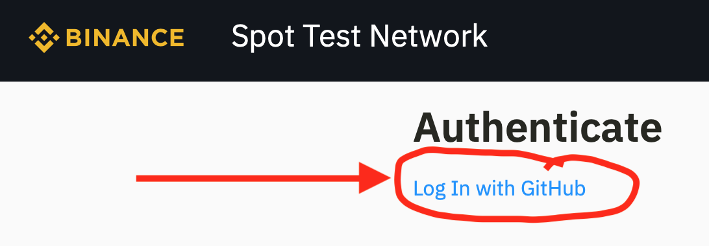
1. Locally generate key pair (rsa between 2048 and 4096 byte or ed25519)
2. registr public key
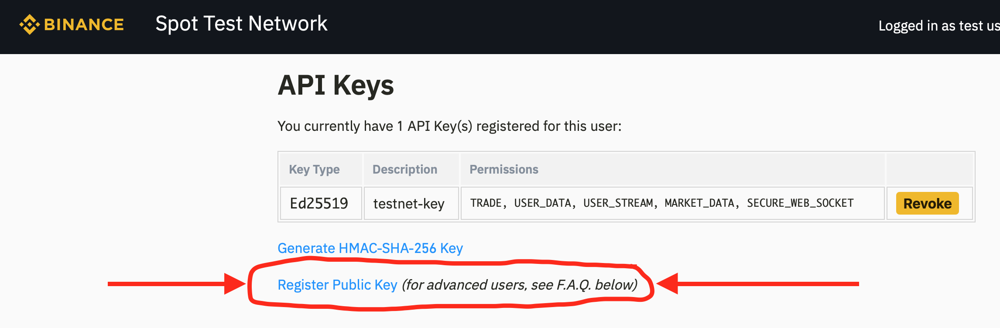

### adding ssh key to ssh-agent [WINDOWS]
    % eval "$(ssh-agent)"
    % ssh-add path/to/private_key

### adding ssh key to ssh-agent [POSIX]
    % eval `ssh-agent`
    % ssh-add path/to/private_key


## Markdown
Pagebreak for generated PDFs: <br>
wrap the section that shall be on a new Page in: 
```
<div style="page-break-after: always;">
    Business as usual
</div>
```

## Microsoft Windows

### Shortcuts
Action | Shortcut | Version
-- | -- | --
Emoji Keyboard | `WINDOWS + .` | 10 or newer

### cmd, bat, etc...
* Alternative name for a command:
  1. create a *.bat file
  2. 
        ```bat
        @echo off
        set "NEW_COMMAND_NAME=C:\path\to\COMMAND_EXECUTABLE"
        %NEW_COMMAND_NAME% %*
        ```
     * The `%NEW_COMMAND_NAME% %*` line executes the Maven command stored in the `NEW_COMMAND_NAME` variable, and `%*` passes any additional arguments to the executable.
     * To find out where the executable is, run `where <executable>`
  3. include the directory where your *.bat is located in your (user-level) `PATH` variable.
  4. Use the new command: `new-command-name` in any Command Prompt.

## Visual Studio
### Shortcuts
Action | Shortcut
-- | --
Comment | `CTRL + K, CTRL + C`
Uncomment | `CTRL + K, CTRL + U`
Collapse all methods | `CTRL + M, CTRL + O`
Expand all methods | `CTRL + M, CTRL + P`
Collapse/expand selection | `CTRL + M, CTRL + M`

## Programming
### Java stream API vs C# LINQ


<table>
<tr>
  <th>Java</th>
  <th>C#</th>
  <th>Java Example</th>
  <th>C# example</th>
</tr>

<tr>
  <td><code>Collection.forEach(&lt;lambda&gt;)</code></td>
  <td><code>Enumerable.ForEach(&lt;lambda&gt;)</code></td>
<td>
    

```java
List<String> strings = new ArrayList<>();
strings.add("demo");
strings.add("list");
strings.add("of");
strings.add("strings");

// Print list entries
strings.forEach(System.out::println);
```

</td>
<td>
    

```c#
List<string> strings = new List<string>
{
    "demo", "list", "of", "strings"
};

// Print list entries
strings.ForEach(Console.WriteLine)
```

</td>
</tr>

<tr>
  <td><code>Collection.stream().map(&lt;lambda&gt;)</code></td>
  <td><code>Enumerable.Select(&lt;lambda&gt;)</code></td>
<td>
    

```java
List<String> strings = new ArrayList<>();
strings.add("demo");
strings.add("list");
strings.add("of");
strings.add("strings");

// convert entries to upper case
List<String> converted = strings.stream()
        .map(str -> str.toUpperCase());
        .collect(Collectors.toList());
```

</td>
<td>
    

```c#
List<string> strings = new List<string>
{
    "demo", "list", "of", "strings"
};

// convert entries to upper case
List<string> converted = strings
        .Select(str => str.ToUpper())
        .ToList();
```

</td>
</tr>

<tr>
  <td><code>Collection.stream().filter(&lt;lambda&gt;)</code></td>
  <td><code>Enumerable.Where(&lt;lambda&gt;)</code></td>
<td>
    

```java
List<String> strings = new ArrayList<>();
strings.add("demo");
strings.add("list");
strings.add("of");
strings.add("strings");

// filter for entries containing the letter 'i'
List<String> filtered = strings.stream()
        .filter(str -> str.contains("i"));
        .collect(Collectors.toList());  // -> [list, strings]
```

</td>
<td>
    

```c#
List<string> strings = new List<string>
{
    "demo", "list", "of", "strings"
};

// filter for entries containing the letter 'i'
List<string> filtered = strings
        .Where(str => str.Contains("i"))
        .ToList();  // -> [list, strings]
```

</td>
</tr>

<tr>
  <td><code>Collection.stream().takeWhile(&lt;lambda&gt;)</code></td>
  <td><code>Enumerable.TakeWhile(&lt;lambda&gt;)</code></td>
<td>
    

```java
List<Integer> numbers = new ArrayList<>();
numbers.add(1);
numbers.add(2);
numbers.add(3);

// take while number n == first entry or n is even
List<Integer> takenNumbers = numbers.stream()
        .takeWhile(n -> n.equals(numbers.get(0))  || n % 2 == 0)
        .collect(Collectors.toList());  // -> [1, 2]
```

</td>
<td>
    

```c#
List<int> numbers = new List<int> { 1, 2, 3 };

// take while number n == first entry or n is even
List<int> takenNumbers = numbers
        .TakeWhile((n, index) => index == 0 || n % 2 == 0)
        .ToList();  // -> [1, 2]
```

</td>
</tr>

</table>

## MongoDB

### cli: drop all tables
```
# mongo
> show dbs
> use <whatever db>
> db.getCollectionNames().forEach(function(c) { if(c.indexOf("system.") == -1) db.getCollection(c).drop(); })
> quit()
```

## Apache Maven

### find unused dependencies
    # mvn dependency:analyze

## Enterprise Architect
### Shortcuts:
Action | shortcut | Note
--|--|--
Reveal Element in Project Browser | `Alt + G` | Element (E.g. on diagram) must be selected
Reveal Diagram in Project Browser (from open diagram) | `SHIFT + Alt + G`
Edit Element Attributes | `F9` | Element must be selected (especially useful with class/interface Elements)
Open Element Properties | `Alt + ENTER` | Element must be selectred
Rename Element | `F2` | Element must be selected
Show Toolbox | `Alt + 5` | Diagram must be opened

### Find EA-Elenets using SQL
1. Navigate to 'Find in Project' (Press `Strg + F` or navigate `Start Ribbon > Search > Search in Model`) <br>
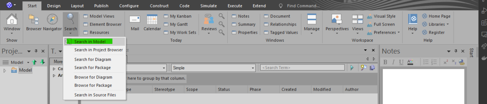<br>
2. Define SQL queries<br>
    a. Create a new Search<br>
    b. Give it a name<br>
    c. Select "SQL Editor"<br>
    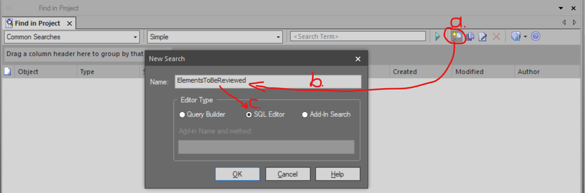<br>
    d. Write Sql Queries <br>
      d.1. If SQL Editor doesn't show up: press the "note-with-pen"-Symbol<br>
      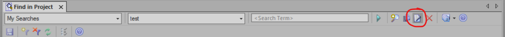<br><br>
3. [Exkurs] *"popular"* tables<br>
    content | table_name
    --|--
    Diagramms | `t_diagram`
    Architecture Elements | `t_object`
    Packages/Directories | `t_package` <br>

    NOTE: The database schema is poorly documented but the SQL-Editor has code compleation, which can give useful hints on which tables and columns are available. It can be triggered pressing `Strg + SPACE`
4. Query pattern for Results linked with the corresponding element in the model
    ```sql
    SELECT <table_name>.ea_guid AS CLASSGUID, <table_name>.<table_type> AS CLASSTYPE [, '<table_name>' AS CLASSTABLE] ... 
    ```
5. Example: Query to find unagreed sequence diagrams (BorgWarner Porsche eTurbo specific)
    ```sql
    SELECT t_diagram.ea_guid AS CLASSGUID, 't_diagram' as CLASSTABLE, t_diagram.Diagram_Type AS CLASSTYPE, t_diagram.Name as Name, t_diagram.Diagram_Type as Type, t_package.Name AS Pkg
    FROM t_diagram, t_package
    WHERE (t_diagram.Package_ID = t_package.Package_ID) AND t_diagram.Diagram_Type LIKE "sequence" AND t_diagram.Version NOT LIKE '*agreed*'
    ```
### Architektur Reviews
#### **Conducting the Review:**
1. Open the Diagram to be Reviewed
2. Use the "Review" Artifact from the Toolbox pane for review remarks<br>
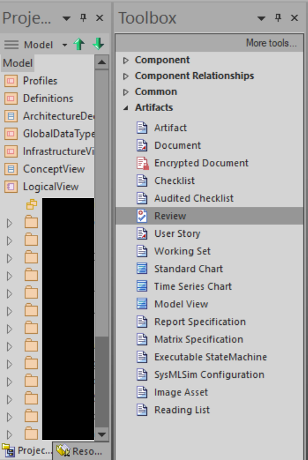<br>
    2.1 If toolbox pane is not visible, reveal it with `Alt + 5` or find it within `Design Ribbon > Diagram > Toolbox`<br>
    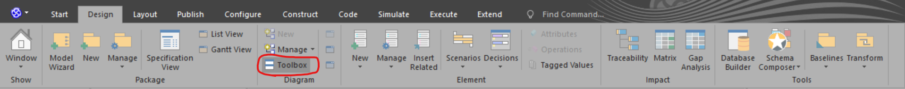
3. [Edge case] Review Items that are not on a Diagram:<br>
    3.1 Use (or create) a random Diagram that is in the same package as the item to be reviewed.<br>
    3.2 Create a Review Artifact as described above<br>
    3.3 Carry out the review as usual<br>
    3.4 Delete the Review Artifact from the diagram -> it will still remain in the package<br>
    (3.5 if a new "helper diagram" has been created for this purpose, it can be deleted)

#### **Compare two architecture versions (Delta Review)**
1. Open a previous (baseline) verison to compare with in EA
2. Navigate to `Publish Ribbon > Model Exchange > Export XMI > Export XMI...`<br>
   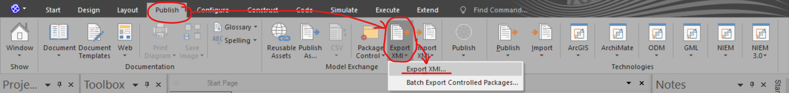<br>
  a. Chose a package to export (Caution, exporting the entire model may be time consuming)<br>
  b. Chose an appropriate location and name<br>
  c. Select the corresponding XMI Type (For EA 13.5 it is XMI1.1, *[Note] The required version will be determined at the latest when the comparison is about to be made.*)<br>
  d. Hit *Export*<br>
    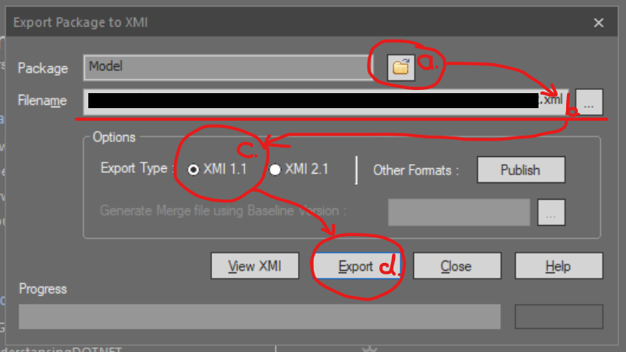<br>
1. Now open the current version in EA
2. Navigate to `Publish Ribbon > Model Exchange > Package Control > Compare Package to XMI`<br>
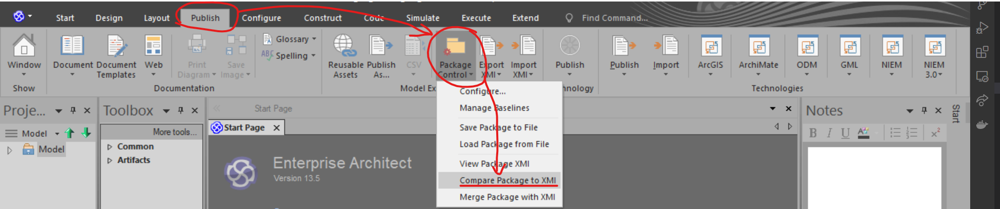
1. Import the previously exported (Step 2) xml file (If the entire model was exportet in Step 2 this will be time consuming) *[Note] If a incompatible XMI Version was used now a warning with a pointer to the correct version would appear -> in this case go back to step 2 and re-export the baseline with the correct XMI version*
2. On the left side all changed files are to be found; on the right-hand side, the changes are displayed in a table. the current version is in the left-hand column, the baseline version is in the right-hand column.
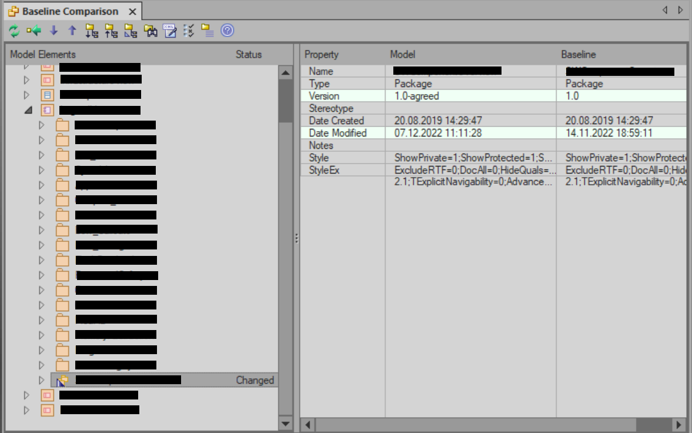

#### **Finding Review Remarks**
1. **Using the "Reviews-Section" (prefered way)**<br>
    1.1 Navigate to `Start Ribbon > Today > Reviews > Manage Reviews`<br>
    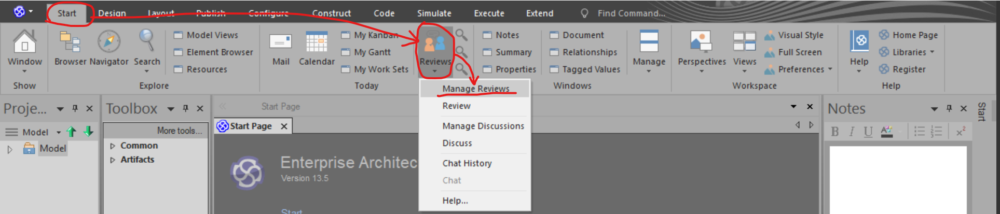<br>
    1.2 To reveal the review Artifact in diagram or project browser: `right click` -> *select the appropriate*
    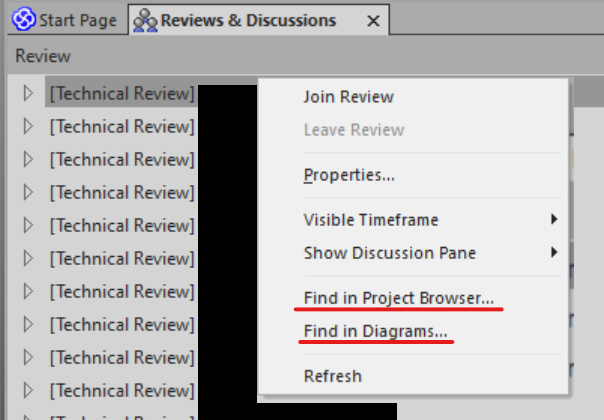
2. **Using SQL to find diagrams with Review Items:**
> see [Find EA-Elenets using SQL](#find-ea-elenets-using-sql)

> DISCLAIMER: 
> The following finds diarams with Review Elements. There may be Review Elements that are not on a Diagram. To find these the query must be adjusted. 
```sql
SELECT
    t_diagram.ea_guid AS CLASSGUID,
    't_diagram' as CLASSTABLE,
    t_diagram.Diagram_Type AS CLASSTYPE
    t_diagram.Name AS [Name],
    t_diagram.Diagram_Type AS [Type],
    t_diagram.Author, t_diagram.Version,
    t_diagram.ModifiedDate
FROM
    t_diagram, t_object, t_diagramobjects
WHERE
    t_diagram.Diagram_ID = t_diagramobjects.Diagram_ID
    AND t_diagramobjects.Object_ID = t_object.Object_ID
    AND t_object.Stereotype = "EAReview"
    AND NOT t_diagram.Diagram_Type = 'Custom'
```
